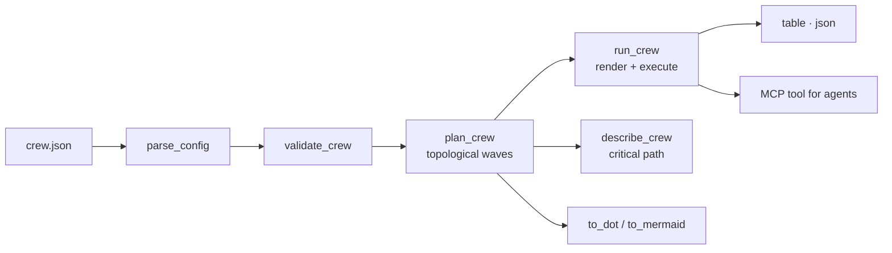

<a name="top"></a>
<div align="center">


# AGENTSMITH

### Config-first scaffolding and orchestration for multi-agent workflows


[](https://pypi.org/project/cognis-agentsmith/) [](https://github.com/cognis-digital/agentsmith/actions) [](LICENSE) [](https://github.com/cognis-digital)

*Describe your agents and tasks as data — validate, plan, and run the workflow deterministically.*

</div>

```bash
pip install cognis-agentsmith
agentsmith init research-crew > crew.json   # scaffold a starter workflow
agentsmith run crew.json                    # validate → plan → execute
```

## Overview

`agentsmith` turns a **crew** — a set of *agents* plus a DAG of *tasks* — into a
validated, deterministic execution plan. You describe the workflow as JSON; the
engine:

1. **Parses & validates** it (unknown agent refs, unknown/self dependencies,
   duplicate ids, dangling `{{placeholder}}` references, and dependency cycles).
2. **Plans** it — a Kahn topological sort grouped into **parallel waves**: each
   wave is a set of tasks with no unmet dependencies, so you can see exactly
   what can run concurrently.
3. **Runs** it — a pure-Python, no-network execution where each task renders its
   prompt template with the outputs of its dependencies (so data actually flows
   through the DAG) and produces a stable, reproducible result digest.

The execution step is the **orchestration substrate**: it is deterministic and
model-free by design, so you can validate topology and data-flow in CI, then
wire a real model into a single function (`_execute_task`) when you want live
inference. Nothing here calls the network.

<!-- cognis:example:start -->
## 🔎 Example output

Real, reproducible output from the tool — runs offline:

```console
$ agentsmith --version
agentsmith 0.1.0
```

```console
$ agentsmith --help
usage: agentsmith [-h] [--version] [--format {table,json}]
                  {validate,plan,run,init,stats,graph,mcp} ...

Config-first multi-agent workflow orchestration.

positional arguments:
  {validate,plan,run,init,stats,graph,mcp}
    validate            validate a crew config
    plan                show execution plan (parallel waves)
    run                 validate, plan and execute the workflow
    init                print a runnable starter crew config
    stats               print structural metrics for a crew config
    graph               export the task DAG (Graphviz DOT or Mermaid)
    mcp                 launch the MCP stdio server (needs the [mcp] extra)

options:
  -h, --help            show this help message and exit
  --version             show program's version number and exit
  --format {table,json}
                        output format
```

```console
$ agentsmith run crew.json
run crew 'research-crew' (2 step(s)):
  [w0] gather -> [researcher] gather::<digest>
  [w1] draft  -> [writer] draft::<digest>
final: [writer] draft::<digest>
```

> Blocks above are real `agentsmith` output — reproduce them from a clone.

<!-- cognis:example:end -->

## Usage — step by step

`agentsmith` is config-first: validate a crew config, inspect its parallel
execution plan, and run it.

1. **Install** (Python 3.10+):
   ```bash
   pip install -e .            # or: pipx install cognis-agentsmith
   ```
2. **Scaffold a starter crew config**, then save it:
   ```bash
   agentsmith init research-crew > crew.json
   ```
3. **Validate** the config and **inspect the execution plan** (topological parallel waves):
   ```bash
   agentsmith validate crew.json
   agentsmith plan crew.json
   ```
4. **Analyze structure** — waves, critical path, and per-agent load:
   ```bash
   agentsmith stats crew.json
   ```
5. **Visualize** the DAG — export Graphviz DOT or Mermaid:
   ```bash
   agentsmith graph crew.json                     # Graphviz DOT
   agentsmith graph crew.json --syntax mermaid    # Mermaid flowchart
   ```
6. **Run the workflow** and read the output (per-step outputs + final result);
   add `--format json` for machine-readable output:
   ```bash
   agentsmith run crew.json --format json | jq '.steps'
   ```
7. **Gate CI** — `validate` exits `1` on a structurally invalid config, `0` when valid:
   ```yaml
   - run: pip install -e . && agentsmith validate crew.json   # non-zero fails the job
   ```

See [`docs/USAGE.md`](docs/USAGE.md) for the full command reference and the crew
config schema.

## Contents

- [Why agentsmith?](#why) · [Features](#features) · [Config schema](#config-schema) · [Commands](#commands) · [Architecture](#architecture) · [AI stack](#ai-stack) · [How it compares](#how-it-compares) · [Integrations](#integrations) · [Install anywhere](#install-anywhere) · [FAQ](#faq) · [Related](#related) · [Contributing](#contributing)

<a name="why"></a>
## Why agentsmith?

Most agent frameworks tangle *what the workflow is* (topology, data-flow) with
*how it runs* (model calls, retries, I/O). `agentsmith` separates the two: the
workflow is **data you can lint, diff, plan, and gate in CI**, and execution is
a clean, deterministic substrate you wire your model into. That means:

- **Deterministic** — same config → same plan → same result digest, every time.
- **No network, no keys, no accounts** to validate and plan a workflow.
- **Scriptable & self-hostable** — a single CLI with `table`/`json` output.
- **MCP-native** — expose it to AI agents over the Model Context Protocol.
- **Polyglot** — reference ports in JavaScript, Go, and Rust live in `ports/`.

<div align="right"><a href="#top">↑ back to top</a></div>

<a name="features"></a>
## Features

- ✅ **Validate** — unknown agent/dep refs, self-deps, duplicate ids, dangling
  `{{placeholders}}`, and cycle detection.
- ✅ **Plan** — Kahn topological sort grouped into deterministic parallel waves.
- ✅ **Run** — template-rendering execution with real data-flow between tasks.
- ✅ **Stats** — waves, max parallelism, roots/leaves, per-agent load, and the
  **critical path** (longest dependency chain).
- ✅ **Graph** — export the DAG as **Graphviz DOT** or **Mermaid**.
- ✅ **Init** — scaffold a runnable starter config.
- ✅ `table` and `json` output; non-zero exit codes for CI gating.
- ✅ **MCP server** (`agentsmith mcp`) for AI agents.
- ✅ Runs on Linux/macOS/Windows · Docker · devcontainer.
- ✅ Reference ports in Python, JavaScript, Go, and Rust (`ports/`).

<div align="right"><a href="#top">↑ back to top</a></div>

<a name="config-schema"></a>
## Config schema

A crew config is a JSON object:

```json
{
  "name": "research-crew",
  "agents": [
    {"id": "researcher", "role": "Research Analyst", "goal": "Gather facts", "model": "local"},
    {"id": "writer",     "role": "Editor",           "goal": "Write a brief", "model": "local"}
  ],
  "tasks": [
    {"id": "gather", "agent": "researcher", "prompt": "Collect sources on the topic"},
    {"id": "draft",  "agent": "writer",     "prompt": "Write a brief using: {{gather}}",
     "depends_on": ["gather"]}
  ]
}
```

| Field | Where | Required | Notes |
|---|---|---|---|
| `name` | root | no | Defaults to `"crew"`. |
| `agents[].id` | agent | **yes** | Matches `^[A-Za-z0-9_.-]+$`; unique. |
| `agents[].role` / `goal` / `model` | agent | no | Free-form; `model` defaults to `"local"`. |
| `tasks[].id` | task | **yes** | Matches `^[A-Za-z0-9_.-]+$`; unique. |
| `tasks[].agent` | task | **yes** | Must reference a declared agent id. |
| `tasks[].prompt` | task | no | May contain `{{dep_id}}` placeholders. |
| `tasks[].depends_on` | task | no | List of task ids; every `{{dep}}` used must appear here. |

**Data-flow rule:** any `{{x}}` placeholder in a task's prompt must correspond
to a declared dependency `x` — otherwise validation fails. At run time the
placeholder is replaced with dependency `x`'s output.

<div align="right"><a href="#top">↑ back to top</a></div>

<a name="commands"></a>
## Commands

| Command | Purpose | Exit code |
|---|---|---|
| `agentsmith init [name]` | Print a runnable starter crew config (JSON). | `0` |
| `agentsmith validate <config>` | Structural validation. | `0` valid · `1` invalid |
| `agentsmith plan <config>` | Topological plan as parallel waves. | `0` · `1` on error |
| `agentsmith stats <config>` | Metrics: waves, critical path, fan-in/out, per-agent load. | `0` · `1` on error |
| `agentsmith graph <config> [--syntax dot\|mermaid]` | Export the DAG. | `0` |
| `agentsmith run <config>` | Validate, plan, and execute. | `0` · `1` on error |
| `agentsmith mcp` | Launch the MCP stdio server (`[mcp]` extra). | `0` · `1` if extra missing |

Global flags: `--version`, `--format {table,json}` (place before the subcommand).

<div align="right"><a href="#top">↑ back to top</a></div>

<a name="architecture"></a>
## Architecture



- **parse/validate** normalize the config into `Agent`/`Task`/`Crew` dataclasses
  and reject malformed or cyclic workflows.
- **plan** computes parallel waves via Kahn topological sort (ties broken by id).
- **run** renders each task's prompt with its dependencies' outputs and produces
  a deterministic digest — the point where you wire in a real model.
- **stats/graph** derive metrics and visualizations from the same validated DAG.

Full detail: [`docs/ARCHITECTURE.md`](docs/ARCHITECTURE.md).

<div align="right"><a href="#top">↑ back to top</a></div>

<a name="ai-stack"></a>
## Use it from any AI stack

- **MCP server** — `agentsmith mcp` exposes a `scan(target)` tool that loads a
  crew config and returns its validation + plan report as JSON.
- **JSON everywhere** — pipe `agentsmith run crew.json --format json` into any
  agent, LLM, or script.
- **CI / scripts** — exit codes make `validate` a drop-in workflow gate.

<div align="right"><a href="#top">↑ back to top</a></div>

<a name="how-it-compares"></a>
## How it compares

| | **Cognis agentsmith** | Typical agent frameworks |
|---|:---:|:---:|
| Self-hostable, no account | ✅ | varies |
| Workflow-as-data (lint / diff / gate) | ✅ | ⚠️ |
| Deterministic plan + result | ✅ | ❌ |
| Runs & validates with no model/keys | ✅ | ❌ |
| MCP-native (AI agents) | ✅ | varies |
| Polyglot reference ports (JS/Go/Rust) | ✅ | ❌ |
| Open license | ✅ COCL | varies |

<div align="right"><a href="#top">↑ back to top</a></div>

<a name="integrations"></a>
## Integrations

Pipes into your stack: **JSON** for anything, an **MCP server** (`agentsmith
mcp`) for AI agents, and a webhook forwarder for SIEM/Slack/Jira. See
[`docs/INTEGRATIONS.md`](docs/INTEGRATIONS.md) and [`INTEROP.md`](INTEROP.md).

<div align="right"><a href="#top">↑ back to top</a></div>

<a name="install-anywhere"></a>
## Install — every way, every platform

```bash
pip install "git+https://github.com/cognis-digital/agentsmith.git"    # pip (works today)
pipx install "git+https://github.com/cognis-digital/agentsmith.git"   # isolated CLI
uv tool install "git+https://github.com/cognis-digital/agentsmith.git" # uv
pip install cognis-agentsmith                                          # PyPI (when published)
docker run --rm ghcr.io/cognis-digital/agentsmith:latest --help        # Docker
```

| Linux | macOS | Windows | Docker | Cloud |
|---|---|---|---|---|
| `scripts/setup-linux.sh` | `scripts/setup-macos.sh` | `scripts/setup-windows.ps1` | `docker run ghcr.io/cognis-digital/agentsmith` | [DEPLOY.md](docs/DEPLOY.md) (AWS/Azure/GCP/k8s) |

<div align="right"><a href="#top">↑ back to top</a></div>

<a name="faq"></a>
## FAQ

**Does `run` call an LLM or the network?**
No. Execution is deterministic and offline by design — it renders prompt
templates and emits a stable digest. Wire a real model into `_execute_task` in
`agentsmith/core.py` when you want live inference; the surrounding validation,
planning, and data-flow stay the same.

**What is a "wave"?**
A set of tasks whose dependencies are all satisfied, so they can run in
parallel. `plan` returns an ordered list of waves; `stats` reports the widest
one as `max_parallel`.

**What is the "critical path"?**
The longest chain of dependent tasks. It bounds the minimum number of
sequential steps regardless of available parallelism — a useful signal for where
a workflow is latency-bound.

**Why do placeholders have to be declared dependencies?**
So data-flow is explicit and verifiable: a prompt can only consume the output of
a task it actually depends on. This is enforced at validation time.

**Is it stable across runs and machines?**
Yes — identical config produces an identical plan and result digest, which makes
it safe to assert on in CI.

<div align="right"><a href="#top">↑ back to top</a></div>

<a name="related"></a>
## Related Cognis tools

- [`skillhub`](https://github.com/cognis-digital/skillhub) — Local skill registry and installer for AI agents
- [`toolguard`](https://github.com/cognis-digital/toolguard) — Runtime allowlist and policy for agent tool-calls
- [`evalbench`](https://github.com/cognis-digital/evalbench) — Offline LLM / agent eval harness with regression gates
- [`ragkit`](https://github.com/cognis-digital/ragkit) — Batteries-included local RAG pipeline — ingest, index, serve
- [`memorybank`](https://github.com/cognis-digital/memorybank) — Portable long-term memory store for agents, exposed over MCP
- [`promptpack`](https://github.com/cognis-digital/promptpack) — Versioned prompt / template registry with A/B and rollbacks

**Explore the suite →** [🗂️ all 170+ tools](https://github.com/cognis-digital/cognis-neural-suite) · [⭐ awesome-cognis](https://github.com/cognis-digital/awesome-cognis) · [🔗 cognis-sources](https://github.com/cognis-digital/cognis-sources)

<div align="right"><a href="#top">↑ back to top</a></div>

<a name="contributing"></a>
## Contributing

PRs, new heuristics, and demo scenarios are welcome under the collaboration-pull
model — see [CONTRIBUTING.md](CONTRIBUTING.md) and [SECURITY.md](SECURITY.md).

> ### ⭐ If `agentsmith` saved you time, **star it** — it genuinely helps others find it.

## Interoperability

`agentsmith` composes with the Cognis suite — JSON in/out and a shared
OpenAI-compatible `/v1` backbone. See **[INTEROP.md](INTEROP.md)** for the
suite map, composition patterns, and reference stacks.

## License

Source-available under the **Cognis Open Collaboration License (COCL) v1.0** — free for personal, internal-evaluation, research, and educational use; **commercial / production use requires a license** (licensing@cognis.digital). See [LICENSE](LICENSE).

---

<div align="center"><sub><b><a href="https://cognis.digital">Cognis Digital</a></b> · one of 170+ tools in the <a href="https://github.com/cognis-digital/cognis-neural-suite">Cognis Neural Suite</a> · <i>Making Tomorrow Better Today</i></sub></div>
